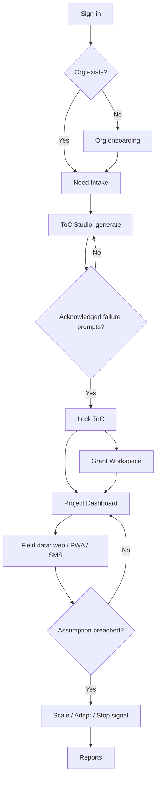
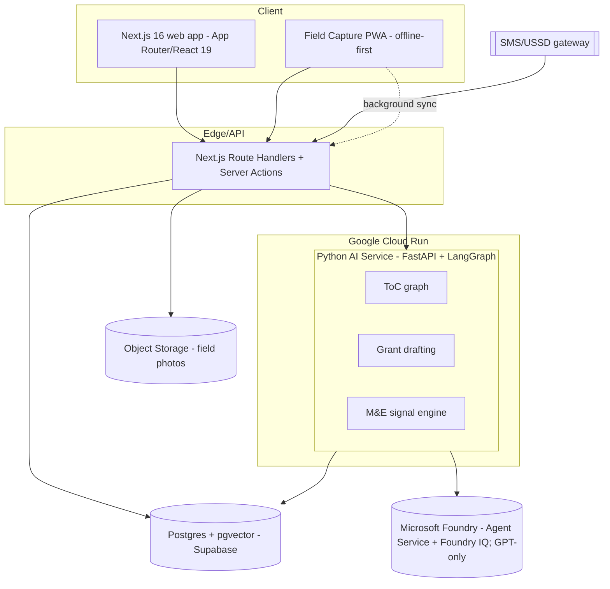

# Proof of Concept — Ciel

**Project:** Ciel — AI-native Impact Operating System for the social sector  
**Event:** Create & Conquer 2026 Hackathon · Theme #2  
**Date:** 2026-06-26  
**Status:** Elimination-round submission artifact

---

## 1. What this PoC demonstrates

Ciel closes the gap from **need identified** to **solution scaled** for NGOs, LGUs, and community organizations. This proof of concept shows:

1. A plain-language social need becomes a **grounded Theory of Change** with cited evidence and "intelligent failure" prompts.
2. A locked ToC becomes a **funder-aligned grant proposal draft**.
3. Field indicators feed a **predictive M&E loop** that recommends scale, adapt, or stop.

The prototype runs as a Next.js web app (Vercel) backed by a Python AI service (Google Cloud Run) and Microsoft Foundry (GPT-only generation + RAG).

---

## 2. User flow

Primary path: sign-in → org onboarding → need intake → ToC Studio → grant workspace → project dashboard → field data → signals/reports.



| Step | Actor | Outcome |
|------|-------|---------|
| Need Intake | Program manager | Plain-language need + context captured |
| ToC Studio | Program manager + AI | Structured ToC with citations; failure prompts acknowledged |
| Grant Workspace | Program manager + AI | Compliance-ready proposal draft aligned to funder KPIs |
| Project Dashboard | Program manager | Live indicators vs ToC assumptions |
| Field Capture | Field volunteer | Offline PWA or SMS entry synced to dashboard |
| Signal | System | Scale / adapt / stop recommendation with rationale |

*Full UX inventory: [prd-ciel.md](prd-ciel.md) §5.*

---

## 3. High-level architecture (SDD §2)

Two-tier application: Next.js product surface + Python AI service on Cloud Run, both fronting Microsoft Foundry and Supabase.



| Layer | Technology | Responsibility |
|-------|------------|----------------|
| Client | Next.js 16, React 19, Tailwind v4, PWA | Product UI, ToC Studio, offline field capture |
| API / Gateway | Next.js Route Handlers + Server Actions | Auth, CRUD, SMS ingest, AI proxy |
| Service / Compute | Python 3.12, FastAPI, LangGraph on Cloud Run | ToC, grant, M&E graphs |
| AI control plane | Microsoft Foundry (GPT-only) | Model hosting, agent runtime, RAG |
| Data | Supabase Postgres + pgvector, Object Storage | App data, embeddings, audit, media |
| Infrastructure | Vercel + Google Cloud Run | Hosting, scaling, secrets |

*Canonical architecture: [sdd-ciel.md](sdd-ciel.md) §2 · Hosting change: [cr-ciel-005.md](cr-ciel-005.md)*

---

## 4. Prototype scope (hackathon slice)

| Module | PRD ID | PoC status |
|--------|--------|------------|
| AI Theory-of-Change Generator | PRD-F1 | **Demonstrated** — generate, critique, lock |
| Grant Writing & Resource Alignment | PRD-F2 | **Demonstrated** — draft + edit + export |
| Predictive M&E + Field Ingestion | PRD-F3 | **Demonstrated** — dashboard signal (demo seed) |
| Org Workspace & Identity | PRD-F4 | **Demonstrated** — org bootstrap + roles |
| Trustworthy-AI Governance | PRD-F5 | Partial — citations, HITL lock gate, audit log |
| Ecosystem Integrations | PRD-F6 | Out of scope (v2) |

---

## 5. How to run locally

```bash
# AI service
cd ai_service && pip install -r requirements.txt
uvicorn ai_service.main:app --reload --port 8000

# Frontend
cd client && pnpm install && pnpm dev

# Seed evidence corpus (optional, for grounded ToC)
python -m ai_service.scripts.seed_evidence
```

Set `AI_SERVICE_URL` and `AI_SERVICE_API_KEY` in the client environment per [build-ciel.md](build-ciel.md).

---

## 6. References

- [prd-ciel.md](prd-ciel.md) — product requirements and user stories
- [sdd-ciel.md](sdd-ciel.md) — system design
- [hackathon-guide.md](hackathon-guide.md) — submission requirements
- [evidence-ciel.md](evidence-ciel.md) — fact-check ledger
