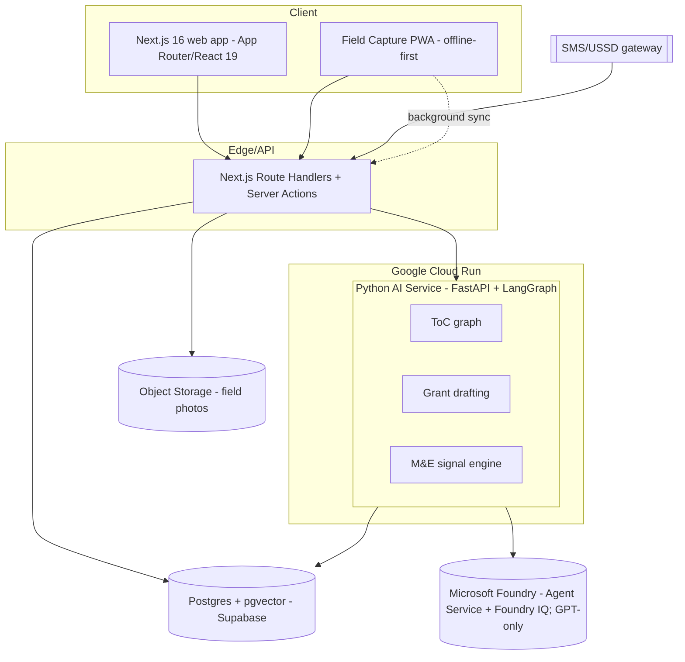

# System Design Document (SDD)

**Project:** Ciel — AI-native Impact Operating System for the social sector
**Date:** 2026-06-25
**Version:** 1.0
**Owner:** Ciel Team — Create & Conquer 2026
**Status:** Locked
**Last reconciled:** 2026-06-26
**PRD:** [prd-ciel.md](prd-ciel.md) · **Evidence:** [evidence-ciel.md](evidence-ciel.md) · **Build:** [build-ciel.md](build-ciel.md)

---

## 1. Architectural Vision & Principles

**Architecture style:** Two-tier app + dedicated AI service. A **Next.js 16** web app (App Router, server-first) for the product surface and lightweight APIs, and a **Python FastAPI + LangGraph** service for the AI reasoning pipelines, both fronting **Microsoft Foundry** (the model/agent/RAG control plane). Data in **Postgres + pgvector**.

**Guiding principles:**
- **Server-first; client components only where interactivity demands** (ToC Studio canvas, field capture).
- **AI decides, deterministic code executes.** LangGraph orchestrates; tools do the work; no business mutation happens "inside" a model turn.
- **Grounded or silent.** Every AI claim cites a retrieved source or is labeled "unverified — needs human input." This is a hard architectural rule, not a prompt suggestion (Trustworthy-AI; [evidence C4](evidence-ciel.md)).
- **Offline is a first-class state**, not an error (field capture; [evidence A3](evidence-ciel.md)).
- **Fail loudly in dev, gracefully in prod** — AI outages degrade to templates + cached evidence, never block field data capture.

**Key trade-offs (explicit V1 debt):**
- **Foundry IQ for managed RAG over a hand-rolled pipeline** — faster to ship, less control over chunking; revisit if retrieval quality demands custom pgvector (see RFC-001).
- **Single Postgres instance** (Supabase) for V1 — read replicas deferred until >1k orgs.
- **SMS via a third-party gateway**, not a telco-direct integration — acceptable cost/latency for pilot scale.
- **One Python service** (no queue broker) for V1 — long jobs use FastAPI background tasks; add a real queue (Redis/RQ) when M&E ingestion volume grows.

---

## 2. High-Level Architecture

**Layers:**

| Layer | Technology | Responsibility |
|-------|------------|----------------|
| Client | Next.js 16.2.9, React 19.2, Tailwind v4, PWA (service worker) | Product UI, ToC Studio canvas, offline field capture, streaming AI views |
| API / Gateway | Next.js Route Handlers + Server Actions; SMS webhook handler | Auth, CRUD, file uploads, SMS ingest, proxy to AI service |
| Service / Compute | Python 3.12, FastAPI, LangGraph | ToC generation graph, grant drafting, M&E signal computation, RAG orchestration |
| AI control plane | **Microsoft Foundry** (Foundry Agent Service on Responses API; Foundry IQ managed retrieval) | Model hosting (**GPT-only** — GPT frontier for generation + critique, GPT-mini for cheap parse), agent runtime, RAG over evidence corpus |
| Data | PostgreSQL + pgvector (Supabase), Object Storage | App data, embeddings, audit log, field media |
| Infrastructure | Vercel (Next.js) + **Google Cloud Run** (Python AI service, containerized — `ai_service/Dockerfile`, managed HTTPS, autoscale) | Hosting, scaling, secrets |

---

## 3. Data Architecture

**Primary database:** PostgreSQL via Supabase — *reason:* Postgres + pgvector + Auth + Storage + Row-Level Security in one managed service; PH-region option for data residency (RA 10173).
**Secondary / cache:** Redis (Upstash) for rate limiting + SMS de-dupe + background-job state — *reason:* serverless-friendly, minimal ops.
**Vector store:** **pgvector** (in the same Postgres) for the evidence corpus embeddings — *reason:* no extra service at pilot scale; Foundry IQ may own retrieval in V1 (RFC-001 decides the split).

### Backend Schema (core tables)

**Table: `organizations`**

| Column | Type | Null? | Default | Key / Index | Constraint |
|--------|------|-------|---------|-------------|------------|
| `id` | UUID | No | gen_random_uuid() | PK | — |
| `name` | TEXT | No | — | — | — |
| `org_type` | TEXT | No | — | — | CHECK in ('ngo','lgu','foundation','csr') |
| `mission` | TEXT | Yes | — | — | rendered as workspace hero (DSD §0) |
| `region` | TEXT | Yes | — | — | PH region for residency/reporting |
| `created_at` | TIMESTAMPTZ | No | now() | — | — |

**Table: `users`**

| Column | Type | Null? | Default | Key / Index | Constraint |
|--------|------|-------|---------|-------------|------------|
| `id` | UUID | No | gen_random_uuid() | PK | maps to Supabase auth uid |
| `email` | TEXT | No | — | UNIQUE idx | lowercased |
| `display_name` | TEXT | Yes | — | — | — |
| `created_at` | TIMESTAMPTZ | No | now() | — | — |

**Table: `memberships`** (org ↔ user with role)

| Column | Type | Null? | Default | Key / Index | Constraint |
|--------|------|-------|---------|-------------|------------|
| `id` | UUID | No | gen_random_uuid() | PK | — |
| `org_id` | UUID | No | — | FK → organizations.id | ON DELETE CASCADE |
| `user_id` | UUID | No | — | FK → users.id | ON DELETE CASCADE |
| `role` | TEXT | No | 'program' | idx (org_id,role) | CHECK in ('admin','program','field','viewer') |

**Table: `projects`**

| Column | Type | Null? | Default | Key / Index | Constraint |
|--------|------|-------|---------|-------------|------------|
| `id` | UUID | No | gen_random_uuid() | PK | — |
| `org_id` | UUID | No | — | FK → organizations.id | ON DELETE CASCADE |
| `need` | TEXT | No | — | — | the plain-language need (PRD-F1) |
| `status` | TEXT | No | 'draft' | — | CHECK in ('draft','active','scaling','stopped') |
| `created_at` | TIMESTAMPTZ | No | now() | idx (org_id,created_at) | — |

**Table: `theories_of_change`** (one current + versions per project)

| Column | Type | Null? | Default | Key / Index | Constraint |
|--------|------|-------|---------|-------------|------------|
| `id` | UUID | No | gen_random_uuid() | PK | — |
| `project_id` | UUID | No | — | FK → projects.id | ON DELETE CASCADE |
| `version` | INT | No | 1 | idx (project_id,version) | never renumbered |
| `graph` | JSONB | No | — | — | nodes: problem/inputs/activities/outputs/outcomes/impact |
| `status` | TEXT | No | 'draft' | — | CHECK in ('draft','locked','superseded') |
| `failure_prompts_ack` | BOOLEAN | No | false | — | must be true before 'locked' (PRD US-01) |
| `created_at` | TIMESTAMPTZ | No | now() | — | — |

**Table: `toc_assumptions`** (the measurable links M&E watches)

| Column | Type | Null? | Default | Key / Index | Constraint |
|--------|------|-------|---------|-------------|------------|
| `id` | UUID | No | gen_random_uuid() | PK | — |
| `toc_id` | UUID | No | — | FK → theories_of_change.id | ON DELETE CASCADE |
| `statement` | TEXT | No | — | — | — |
| `indicator` | TEXT | No | — | — | leading indicator name |
| `threshold` | NUMERIC | Yes | — | — | breach triggers a signal |

**Table: `evidence_sources`** (RAG corpus + provenance)

| Column | Type | Null? | Default | Key / Index | Constraint |
|--------|------|-------|---------|-------------|------------|
| `id` | UUID | No | gen_random_uuid() | PK | — |
| `title` | TEXT | No | — | — | — |
| `url` | TEXT | Yes | — | — | — |
| `tier` | TEXT | No | — | — | CHECK in ('T1','T2','T3','T4') (evidence discipline) |
| `chunk` | TEXT | No | — | — | retrieved unit |
| `embedding` | VECTOR(1536) | Yes | — | ivfflat idx | pgvector |

**Table: `funders`** (donor/agency catalog for PRD-F2 matching)

| Column | Type | Null? | Default | Key/Index | Constraint |
|--------|------|-------|---------|-----------|------------|
| `id` | UUID | No | gen_random_uuid() | PK | — |
| `name` | TEXT | No | — | — | — |
| `type` | TEXT | No | — | — | CHECK in ('foundation','csr','government','multilateral') |
| `region` | TEXT | Yes | — | — | — |
| `focus_areas` | TEXT[] | No | '{}' | — | — |
| `kpis` | TEXT[] | No | '{}' | — | proposal aligns reporting to these |
| `priorities` | JSONB | No | '{}' | — | voice + submission requirements |
| `typical_grant_php_min/max` | NUMERIC | Yes | — | — | indicative range |

**Table: `grant_proposals`**

| Column | Type | Null? | Default | Key/Index | Constraint |
|--------|------|-------|---------|-----------|------------|
| `id` | UUID | No | gen_random_uuid() | PK | — |
| `project_id` | UUID | No | — | FK → projects.id | ON DELETE CASCADE |
| `funder_id` | UUID | Yes | — | FK → funders.id | ON DELETE SET NULL |
| `title` | TEXT | Yes | — | — | — |
| `sections` | JSONB | No | — | — | per-section `{key,heading,content,source_ids,ai_generated,edited_by_human}`; AI never overwrites human edits |
| `amount_php` | NUMERIC | Yes | — | — | feeds BRD-M5 |
| `status` | TEXT | No | 'draft' | — | CHECK in ('draft','in_review','final') |
| `updated_at` | TIMESTAMPTZ | No | now() | — | auto-touched by trigger |

**Table: `field_entries`** (web / PWA / SMS ingestion)

| Column | Type | Null? | Default | Key/Index | Constraint |
|--------|------|-------|---------|-----------|------------|
| `id` | UUID | No | gen_random_uuid() | PK | — |
| `project_id` | UUID | No | — | FK → projects.id | ON DELETE CASCADE |
| `source` | TEXT | No | — | — | CHECK in ('web','pwa','sms') |
| `payload` | JSONB | No | — | — | parsed indicator values |
| `client_uuid` | UUID | Yes | — | UNIQUE idx | idempotency for offline sync |
| `recorded_at` | TIMESTAMPTZ | No | now() | idx (project_id,recorded_at) | — |

**Table: `signals`** (scale/adapt/stop)

| Column | Type | Null? | Default | Key/Index | Constraint |
|--------|------|-------|---------|-----------|------------|
| `id` | UUID | No | gen_random_uuid() | PK | — |
| `project_id` | UUID | No | — | FK → projects.id | ON DELETE CASCADE |
| `assumption_id` | UUID | Yes | — | FK → toc_assumptions.id | — |
| `signal_type` | TEXT | No | — | — | CHECK in ('scale','adapt','stop') |
| `rationale` | TEXT | No | — | — | grounded explanation |
| `created_at` | TIMESTAMPTZ | No | now() | — | — |

**Table: `audit_log`** (append-only)

| Column | Type | Null? | Default | Key/Index | Constraint |
|--------|------|-------|---------|-----------|------------|
| `id` | BIGINT | No | identity | PK | — |
| `org_id` | UUID | No | — | idx | — |
| `actor_id` | UUID | Yes | — | — | — |
| `action` | TEXT | No | — | — | — |
| `entity` | TEXT | No | — | — | — |
| `at` | TIMESTAMPTZ | No | now() | idx (org_id,at) | immutable |

**Key relationships:** Org 1:N Projects · Project 1:N ToC versions · ToC 1:N Assumptions · Project 1:N FieldEntries/Signals/Proposals · Org N:M Users via Memberships.
**Indexes & performance:** composite `(project_id, recorded_at)` for the indicator timeline; `(org_id, at)` for audit; ivfflat on embeddings. Everything else PK/FK lookup.
**Migration strategy:** Supabase SQL migrations, forward-only; every migration backward-compatible for one release so PRD §9 rollback stays safe.
**Caching strategy:** Redis — rate-limit counters (TTL 60s), SMS de-dupe keys (TTL 24h), generated-evidence cache (TTL 6h).
**Data protection:** Row-Level Security so a user only sees their org's rows; PII (emails, field-subject data) treated as personal data under RA 10173 (CLR).

**Onboarding bootstrap (functions & policies, [CR-003](cr-ciel-003.md)):** Creating the *first* organization is a chicken-and-egg under RLS (you can only add an admin membership if you are already an admin). It is resolved by a `SECURITY DEFINER` RPC **`public.create_organization(name, org_type, mission, region)`** that inserts the `organizations` row **and** the creator's `admin` `memberships` row atomically, returning the new org id. `EXECUTE` is granted to `authenticated` only (revoked from `anon`); the function raises `not authenticated` when `auth.uid()` is NULL. A complementary scoped policy `"Creators can insert initial admin membership"` permits a first member to self-insert exactly one `admin` row for an org that has no members yet.

---

## 4. API Design & External Integrations

**API style:** REST Route Handlers + Server Actions (web app) → typed calls to the FastAPI AI service (internal).

**Internal endpoints (high-level):**

| Method | Path | Purpose |
|--------|------|---------|
| POST | `/api/onboarding` | Create workspace: org + creator `admin` membership (atomic RPC `create_organization`, PRD-F4) |
| POST | `/api/needs` | Create a need / project (PRD-F1) |
| POST | `/api/toc/generate` | Proxy to AI service ToC graph (streamed) |
| POST | `/api/toc/:id/lock` | Lock a ToC (requires failure_prompts_ack) |
| POST | `/api/grants/generate` | Stream a funder-matched proposal from the locked ToC (SSE, PRD-F2) |
| POST | `/api/grants` | Persist a generated proposal draft (role-gated by RLS) |
| PATCH | `/api/grants/:id` | Save section edits / status / amount (human owns the pen) |
| POST | `/api/field/entry` | Ingest web/PWA entry (idempotent via client_uuid) |
| POST | `/api/sms/webhook` | Inbound SMS → parse → field_entry (PRD-F3) |
| GET | `/api/projects/:id/signals` | Current scale/adapt/stop signals |
| POST | `/api/reports/export` | Return-on-Mission + compliance export (PRD-F5) |

**AI service (FastAPI, internal):** `POST /toc`, `POST /grant`, `POST /mande/evaluate` — all return structured JSON with per-claim source refs.

**External integrations:**

| Service | Purpose | Rate Limits / Fallback |
|---------|---------|------------------------|
| Microsoft Foundry (GPT, Foundry IQ) | Generation + managed RAG | 429 → backoff + queue; degrade to template + cached evidence; never silent-retry past a refusal |
| SMS/USSD gateway (PH provider) | Field ingestion from feature phones | delivery webhook + retry; de-dupe by message id; clarifying reply on parse fail |
| Supabase (Auth/DB/Storage) | Identity, data, media | connection pool; RLS; daily backups |
| PostHog (self-host option) | Analytics events (PRD §5.5) | non-blocking; drop on failure |
| Donor CRMs (Bloomerang/Benevity) | v2 only — not integrated in V1 | — |

---

## 5. Security & Authorization

**Authentication:** Supabase Auth (email magic link + password); org invite links.
**Session management:** JWT in httpOnly cookies, short-lived access + refresh; SSR-safe via `@supabase/ssr`.
**Authorization model:** Postgres **Row-Level Security** keyed on `memberships`; role gates (admin/program/field/viewer). Field role can write `field_entries` but not read financials. First-member onboarding uses a scoped bootstrap policy + a `SECURITY DEFINER` RPC (`create_organization`) to avoid the empty-membership chicken-and-egg ([CR-003](cr-ciel-003.md)).
**Data protection:**
- PII encrypted at rest (Supabase managed) + RLS; field-subject data minimized and consented (RA 10173 → CLR).
- Secrets in platform env (Vercel / GCP Secret Manager), never committed; Foundry keys scoped to the AI service.
- Input validation: Zod (Next.js) + Pydantic (FastAPI) on every boundary.
- Append-only `audit_log` for consequential actions (PRD US-05).

---

## 6. Infrastructure, CI/CD & Deployment

**Hosting:** Vercel (Next.js app + Route Handlers); **Google Cloud Run** (Python AI service, **containerized** — build from [ai_service/Dockerfile](../ai_service/Dockerfile), deploy via `gcloud run deploy` or Cloud Build; managed HTTPS, autoscale-to-zero in staging); Supabase (DB/Auth/Storage); Upstash Redis. Microsoft Foundry (model inference) remains a separate Azure-hosted control plane called over HTTPS.
**Environments:** `dev` (local + Supabase branch), `staging` (Vercel preview + Cloud Run staging service + staging Foundry deployment), `prod` (Vercel prod + Cloud Run prod service).
**CI/CD:** GitHub Actions — lint → type-check → test (incl. AI eval gate from QAD) → build container → deploy to Cloud Run. Preview on PR; prod on tagged release. Feature flags gate Modules 2–3.
**Backup & DR:**
- Backups: Supabase automated daily snapshots, 30-day retention; object storage versioned.
- **RTO 4h · RPO 24h** for V1/pilot.
- Restore drill: to be run before any production pilot (a backup never restored is not a backup).

---

## 7. Non-Functional Requirements

| Requirement | Target | Notes |
|-------------|--------|-------|
| API response (p95) | < 300ms | non-AI CRUD paths |
| AI stream first token | < 1.5s; full ToC draft < 30s | streamed to ToC Studio |
| Grant draft | < 60s/section | |
| Uptime | 99.5% (pilot) | app + AI service |
| Max concurrent users V1 | 200 | pilot scale |
| **Offline field capture** | 100% capture without connectivity; sync on reconnect with zero data loss | idempotent `client_uuid` (RFC-002) |
| **SMS round-trip** | parsed + acknowledged < 30s | feature-phone reach |
| Data residency | PH-region DB option | RA 10173 |
| Data retention | program data per-org policy; logs 30d | configurable |

**Trustworthy-AI NFRs (Deloitte 7 dimensions; [evidence C4](evidence-ciel.md)) — testable commitments:**
1. *Transparent/explainable* — every output cites sources or flags "unverified." 2. *Fair/impartial* — bias evals on cohort-affecting outputs (QAD). 3. *Robust/reliable* — graceful degradation, no silent retries. 4. *Privacy* — RLS + RA 10173 minimization. 5. *Safe/secure* — §8.1 controls. 6. *Responsible* — HITL on every consequential step. 7. *Accountable* — append-only audit log + provenance.

---

## 8. AI / Agent Architecture

**AI approach:** RAG-grounded generation orchestrated by **LangGraph** over **Microsoft Foundry**. Foundry IQ provides managed retrieval over the curated evidence corpus; LangGraph state machines run the multi-step reasoning (interrogate → retrieve → draft → self-critique → structure). Pattern mirrors McKinsey's Lilli (vector retrieval → cited artifacts; [evidence C3](evidence-ciel.md)).

**Model selection:**

| Agent / Task | Model | Reason |
|-------------|-------|--------|
| ToC interactive generation | GPT (frontier, via Foundry) | strong grounded reasoning at interactive cost |
| "Intelligent failure" adversarial critique | GPT (frontier, via Foundry) | separate pass with an adversarial system prompt + lower temperature; runs once per ToC, rate-limited |
| Grant section drafting | GPT (frontier) | structured long-form with citations |
| M&E signal rationale | GPT (frontier) | concise grounded interpretation |
| Cheap classify/parse (SMS intent) | GPT-mini | low-cost, fast |

> **Model note (cr-ciel-002):** Ciel runs **GPT-only** on Microsoft Foundry — the team's Foundry tenant exposes only GPT deployments. The adversarial critique is a separate GPT pass (distinct privileged prompt + lower temperature), not a different model family; the QAD grounding/safety evals are the real gate. Exact deployment names are perishable — pin them at build time per BUILD §3.

**Context architecture:** system prompt (privileged, cached prefix) + injected org/project context + retrieved evidence chunks. Max context ~50k tokens/request. Prompt-prefix caching on the static system instructions (high hit rate expected).

**Tool surface (function-calling):**

| Tool | Purpose | Risk Level |
|------|---------|------------|
| `retrieve_evidence` | Foundry IQ / pgvector query | Read-only, low |
| `write_toc_draft` | persist a ToC draft | Write, app-mediated (no destructive overwrite) |
| `draft_grant_section` | produce proposal section | Write draft only, HITL to finalize |
| `compute_signal` | evaluate indicators vs assumptions | Read + recommend only (never auto-acts) |

**HITL gates:** lock-ToC requires human ack of failure prompts; proposals require human review; signals are recommendations only.

**Token / cost budget:**

| Operation | Est. tokens | Est. cost (Sonnet-class) | Monthly assumption |
|-----------|-------------|--------------------------|--------------------|
| ToC generation | ~8–12k | ~$0.04–0.07 | 25 orgs × ~10 = ~$15 |
| Failure critique (Opus) | ~10k | ~$0.30 | rate-limited; ~1/ToC |
| Grant section | ~6k | ~$0.03 | varies |
| SMS parse (Haiku) | ~1k | ~$0.001 | high volume, cheap |

**Fallback behavior:** model error → clear user message; ≤2 retries with backoff; then degrade to templates + cached evidence. Field capture never blocks on AI.

### 8.1 AI Safety & Threat Surface

| Risk (OWASP LLM) | Applies? | Control in this system | Eval (QAD ref) |
|------------------|----------|------------------------|----------------|
| LLM01 Prompt injection (direct + indirect via retrieved/field content) | **Yes** | Retrieved + user/field content wrapped + delimited as untrusted *data*; tools never auto-execute instructions found in content; system prompt privileged | QAD AI-04 |
| LLM02 Insecure output handling | **Yes** | Model output is data, never executed; escaped before render; no `eval`; JSON validated against schema | QAD AI-05 |
| LLM06 Sensitive-info disclosure | **Yes** | No secrets in prompts; field-subject PII minimized before send; output scanned for leaked context | QAD AI-06 |
| LLM07 Excessive agency / over-permissioned tools | **Yes** | Least-privilege tool scopes; write tools app-mediated; signals never auto-act; spend caps | QAD AI-07 |
| Jailbreak / guardrail bypass | **Yes** | Out-of-policy asks refused; no silent retry past refusal | QAD AI-08 |
| Hallucination causing user harm (mis-allocated aid) | **Yes (critical)** | Grounded-only; cite sources; "unverified — needs human input" is an acceptable output; HITL on all consequential outputs | QAD AI-01/02/03 |

**Data sent to model providers:** user prompt + retrieved evidence chunks + minimized org context; **no raw subject PII**.
**Provider retention / terms:** Microsoft Foundry enterprise terms — prompts/outputs **not used to train foundation models**; configure data-zone/region; prefer zero/short-retention where available. *(Reconcile with CLR §1 sub-processors.)*
**Region / residency:** prefer a Foundry deployment region consistent with PH data-residency posture.
**Trust boundary:** anything a user or a field/3rd-party source can influence is untrusted — it can *request* but never *command* a tool call.

---

## Self-Check

- [x] §2 has an actual diagram (Mermaid)
- [x] §3 defines every core table with typed columns, keys, constraints + migration strategy
- [x] every external integration in §4 has a rate-limit / fallback
- [x] §7 latency targets are specific numbers + offline/SMS NFRs + Trustworthy-AI commitments
- [x] §8 filled (AI is core); §8.1 maps each applicable OWASP-LLM risk to a control + QAD eval; provider terms recorded
- [x] V1 shortcuts documented as explicit debt in §1
- [x] Answers *how* to build (the *what* lives in [prd-ciel.md](prd-ciel.md))
